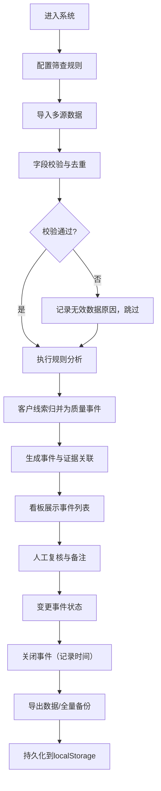

## 1. 产品概述

面向客服主管的本地售后工单质量分析看板，支持导入多源售后数据（客服工单CSV、回访评分CSV、退款JSON），按可配置规则自动识别超时工单、低分回访、重复投诉和高额退款四类质量问题，并将同一客户在时间窗口内的关联线索归并为"质量事件"，支持人工复核、状态流转与全量数据导出。

- **目标用户**：客服团队主管、质量管理人员
- **解决问题**：售后质量线索散落在多系统、多格式数据中，人工筛查效率低、遗漏率高；同一客户的投诉、低分、退款往往被割裂看待，缺乏系统性的事件视角
- **核心价值**：一站式数据清洗 → 规则筛查 → 事件归并 → 复核闭环 → 数据留存的质量分析全流程

---

## 2. 核心功能

### 2.1 用户角色
| 角色 | 注册方式 | 核心权限 |
|------|----------|----------|
| 主管用户 | 无需注册（本地单用户） | 导入数据、配置规则、查看看板、复核事件、关闭事件、导出数据 |

### 2.2 功能模块
1. **数据导入页**：工单CSV导入、回访评分CSV导入、退款JSON导入、样例数据一键生成、导入校验报告
2. **规则配置页**：四类规则参数配置、配置合法性校验、配置持久化
3. **分析看板页**：事件总览统计、事件列表筛选、事件详情抽屉、证据溯源展示
4. **事件复核页**：事件状态变更、复核备注编辑、批量操作、关闭记录
5. **数据导出页**：事件CSV/JSON导出、证据明细导出、全量备份导出/恢复

### 2.3 页面详情
| 页面名称 | 模块名称 | 功能描述 |
|----------|----------|----------|
| 数据导入页 | 文件上传区 | 拖拽或点击上传，支持CSV/JSON格式识别，文件大小限制提示 |
| 数据导入页 | 字段映射校验 | 自动匹配字段名，缺失customer_id/时间字段时标红，给出校验统计（有效条数/跳过条数/原因） |
| 数据导入页 | 样例数据生成 | 一键生成三类样例数据文件，可下载后再导入用于演示 |
| 数据导入页 | 导入记录列表 | 展示历史导入记录（文件名、类型、条数、导入时间、文件哈希用于去重） |
| 规则配置页 | 超时规则 | 配置工单SLA时长阈值（小时），超过则标记为超时 |
| 规则配置页 | 低分规则 | 配置回访评分最低阈值（1-5分），低于则标记为低分 |
| 规则配置页 | 重复投诉规则 | 配置时间窗口（天）与投诉次数阈值，同一客户窗口内超过N次工单为重复投诉 |
| 规则配置页 | 高额退款规则 | 配置退款金额阈值（元），超过则标记为高额退款 |
| 规则配置页 | 配置校验 | 非法值（负数、超出范围、空值）时禁止保存并给出具体提示 |
| 分析看板页 | 统计卡片 | 四类问题事件数、未复核数、已关闭数、涉及客户数 |
| 分析看板页 | 事件列表 | 按客户/类型/时间/状态筛选，支持分页与排序 |
| 分析看板页 | 事件详情抽屉 | 展示事件基本信息、关联证据列表（每条证据可展开查看原始字段）、复核操作区 |
| 事件复核页 | 复核工作区 | 待复核事件队列、逐条审核、状态变更（待复核→复核中→已关闭） |
| 事件复核页 | 备注编辑 | 支持富文本备注，记录复核结论与处理措施 |
| 数据导出页 | 导出选项 | 选择导出范围（全量/按状态/按类型）、格式（CSV/JSON）、是否包含证据明细 |
| 数据导出页 | 全量备份 | 导出含所有数据+规则+状态的完整JSON，支持导入恢复 |

---

## 3. 核心流程

### 主流程描述
1. 主管进入系统，首先在**规则配置页**设置筛查规则参数（首次可使用默认值）
2. 进入**数据导入页**，上传客服工单CSV、回访评分CSV、退款JSON；系统对每行/每条数据进行字段校验（customer_id不能为空、时间字段可解析、金额字段非负），无效数据跳过并记录原因
3. 系统对退款文件做哈希去重，同一文件重复导入时直接拒绝，不破坏已有数据
4. 点击"执行分析"，分析引擎按配置规则识别四类质量线索，并将**同一customer_id在时间窗口内**的多条线索归并为一个质量事件（事件类型取命中的所有类型），每条来源证据保留原始字段并关联到事件
5. 进入**分析看板**查看分析结果，在**事件复核页**对待复核事件逐条审核：填写复核备注、变更状态
6. 事件处理完成后标记为"已关闭"，系统自动记录关闭时间
7. 在**数据导出页**导出事件列表、证据明细，或做全量备份；刷新/重启浏览器后数据与状态从localStorage恢复，与关闭前完全一致

### 流程图

---

## 4. 用户界面设计

### 4.1 设计风格
- **主色调**：深墨蓝 `#1e3a5f`（专业、可信）搭配暖琥珀 `#d97706`（警示、待处理）
- **辅助色**：翠绿 `#059669`（已关闭/正常）、玫红 `#dc2626`（高风险/高额退款）
- **背景**：浅灰蓝渐变 `#f8fafc → #f1f5f9`，卡片纯白配细边框 + 微阴影
- **按钮风格**：圆角10px，主按钮实心渐变，次按钮描边，hover有轻微上浮+阴影增强
- **字体**：标题用 "Noto Serif SC" 衬线体（稳重感），正文与数据用 "JetBrains Mono" 等宽体（数字对齐清晰）
- **布局风格**：左侧固定导航栏 + 顶部统计条 + 主内容卡片网格；事件详情采用右滑抽屉，避免页面跳转打断上下文
- **图标风格**：lucide-react 线性图标，统一 18px，hover 有轻微变色

### 4.2 页面设计概述
| 页面名称 | 模块名称 | UI元素 |
|----------|----------|--------|
| 数据导入页 | 文件上传卡 | 虚线边框拖放区，图标+文字居中，hover边框变主色，上传后显示文件名/大小/进度条 |
| 数据导入页 | 校验报告 | 三色统计块（绿/有效、黄/警告、红/错误），下方列表逐条展示错误行号与原因 |
| 规则配置页 | 规则表单 | 每组规则一张卡片，左侧图标+标题，右侧输入框，底部实时显示"当前配置将命中约 X% 数据"预估 |
| 分析看板页 | 统计条 | 5张数字卡片横向排列，hover有轻微放大，底部带环比小箭头 |
| 分析看板页 | 事件表格 | 斑马纹行，状态列带彩色徽标，点击行展开抽屉展示证据链（时间线样式） |
| 分析看板页 | 证据时间线 | 左侧竖线连接节点，节点颜色对应证据类型，右侧展示原始数据字段 |
| 事件复核页 | 复核区 | 左右分栏：左侧事件队列（可滚动），右侧详情+备注编辑+状态切换按钮组 |
| 数据导出页 | 导出面板 | 复选框组选择导出范围，单选按钮选格式，大按钮导出后显示下载链接+文件大小 |

### 4.3 响应式
- **桌面优先**（≥1280px）：左侧导航固定240px，主内容区三栏网格
- **平板**（768-1279px）：导航折叠为图标栏，主内容两栏网格
- **手机**（<768px）：导航改为底部Tab栏，统计卡片纵向堆叠，表格改为卡片式列表

### 4.4 动效设计
- 页面初次加载：统计卡片数字从0滚动到目标值（800ms ease-out）
- 抽屉打开：从右侧滑入（300ms cubic-bezier(0.4, 0, 0.2, 1)），背景遮罩淡入
- 状态变更：徽标颜色切换有200ms渐变过渡
- 表格行hover：背景色浅蓝渐变，左侧显示3px主色竖条
- 导出按钮：点击后有脉冲涟漪效果，下载完成时出现对号飞入动画
