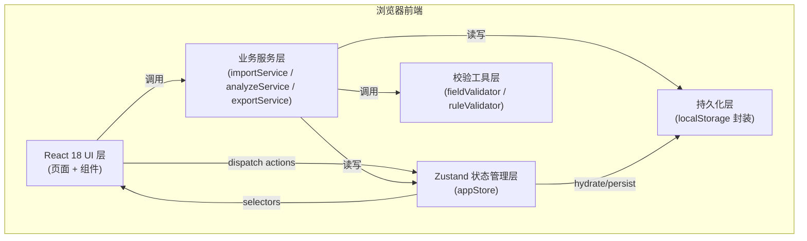
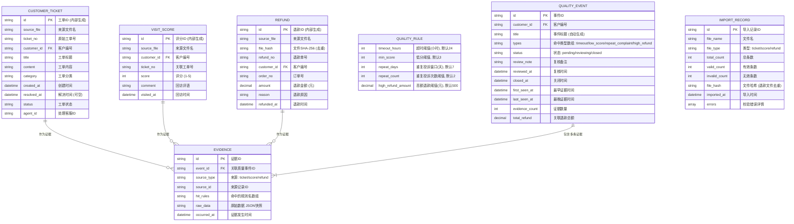

## 1. 架构设计

本系统为纯前端本地应用，无需后端服务，所有数据存储于浏览器 localStorage。通过 Zustand 实现全局状态管理，通过模块分层保证可维护性。



---

## 2. 技术描述

- **前端框架**：React@18 + TypeScript@5
- **构建工具**：Vite@5
- **样式方案**：Tailwind CSS@3（原子化 + CSS 变量主题）
- **状态管理**：Zustand@4（含 persist 中间件做 localStorage 持久化）
- **路由**：React Router DOM@6（HashRouter，兼容本地 file:// 打开）
- **图标**：lucide-react
- **CSV解析**：papaparse@5（前端纯解析，无需后端）
- **日期处理**：dayjs（轻量，支持多格式解析）
- **哈希校验**：Web Crypto API SHA-256（用于退款文件去重）
- **后端**：无（纯前端本地应用）
- **数据库**：localStorage（通过 Zustand persist 自动序列化/反序列化）

**初始化方式**：`npm init vite-init@latest -y . -- --template react-ts --force`

---

## 3. 路由定义

| 路由路径 | 页面组件 | 用途 |
|----------|----------|------|
| `/` | `DashboardPage` | 分析看板首页（默认路由），展示统计卡片与事件列表 |
| `/import` | `ImportPage` | 数据导入（CSV工单 / CSV评分 / JSON退款 + 样例生成） |
| `/rules` | `RulesPage` | 四类质量筛查规则参数配置 |
| `/review` | `ReviewPage` | 事件复核工作区（备注编辑、状态变更、关闭） |
| `/export` | `ExportPage` | 数据导出与全量备份/恢复 |

---

## 4. 数据模型

### 4.1 ER 图



### 4.2 Zustand Store 状态定义

```typescript
// 核心数据实体类型
interface CustomerTicket { /* 字段见ER图 */ }
interface VisitScore { /* 字段见ER图 */ }
interface Refund { /* 字段见ER图 */ }
interface QualityRule { /* 字段见ER图 */ }
interface QualityEvent { /* 字段见ER图 */ }
interface Evidence { /* 字段见ER图 */ }
interface ImportRecord { /* 字段见ER图 */ }

interface AppState {
  // 原始数据
  tickets: CustomerTicket[];
  scores: VisitScore[];
  refunds: Refund[];

  // 规则配置
  rules: QualityRule;

  // 分析结果
  events: QualityEvent[];
  evidences: Evidence[];

  // 导入记录
  importRecords: ImportRecord[];

  // 导入相关 actions
  importTickets: (file: File) => Promise<ImportResult>;
  importScores: (file: File) => Promise<ImportResult>;
  importRefunds: (file: File) => Promise<ImportResult>;
  generateSampleData: () => SampleFiles;

  // 规则相关 actions
  updateRules: (rules: Partial<QualityRule>) => ValidationResult;
  validateRules: (rules: QualityRule) => ValidationResult;

  // 分析相关 actions
  runAnalysis: () => AnalysisResult;

  // 复核相关 actions
  updateEventStatus: (id: string, status: EventStatus, note?: string) => void;
  closeEvent: (id: string, note?: string) => void;
  batchUpdateStatus: (ids: string[], status: EventStatus) => void;

  // 导出相关 actions
  exportEventsCSV: (filter?: ExportFilter) => Blob;
  exportEventsJSON: (filter?: ExportFilter) => Blob;
  exportFullBackup: () => Blob;
  restoreFromBackup: (file: File) => Promise<void>;

  // 重置
  resetAll: () => void;
}
```

---

## 5. 核心模块设计

### 5.1 字段校验模块 (`src/utils/fieldValidator.ts`)
| 函数 | 输入 | 输出 | 失败处理 |
|------|------|------|----------|
| `validateTicket(row)` | 原始CSV行对象 | `{valid, data, errors}` | customer_id空/时间不可解析→记录errors，跳过 |
| `validateScore(row)` | 原始CSV行对象 | `{valid, data, errors}` | score不在1-5范围→跳过 |
| `validateRefund(obj)` | 原始JSON对象 | `{valid, data, errors}` | amount为负/非数字→跳过 |
| `parseDate(str)` | 任意日期字符串 | `Date \| null` | 支持ISO/YYYY-MM-DD/YYYY/MM/DD/中文格式，全部失败返回null |
| `hashFile(file)` | File对象 | `Promise<string>` | Web Crypto SHA-256 |

### 5.2 规则校验模块 (`src/utils/ruleValidator.ts`)
| 函数 | 输入 | 输出 | 非法情形 |
|------|------|------|----------|
| `validateTimeoutRule(v)` | number | `{valid, message}` | v≤0 / 非整数 |
| `validateMinScoreRule(v)` | number | `{valid, message}` | v<1或v>5 / 非整数 |
| `validateRepeatDaysRule(v)` | number | `{valid, message}` | v≤0 / 非整数 / v>365 |
| `validateRepeatCountRule(v)` | number | `{valid, message}` | v<2 / 非整数 |
| `validateHighRefundRule(v)` | number | `{valid, message}` | v<0 / 非数字 |
| `validateAllRules(rules)` | QualityRule | `{valid, fieldErrors}` | 批量校验并返回各字段错误 |

### 5.3 分析引擎模块 (`src/services/analyzeService.ts`)
分析流程分四步：

**Step 1 - 单条线索筛查**：
```
遍历所有工单 → 计算 resolved_at - created_at > timeout_hours → 标记 timeout
遍历所有评分 → score < min_score → 标记 low_score
遍历所有退款 → amount > high_refund_amount → 标记 high_refund
```

**Step 2 - 重复投诉筛查**：
```
按 customer_id 分组工单 → 按时间排序 → 滑动窗口检查 repeat_days 天内工单数量 ≥ repeat_count → 窗口内所有工单标记 repeat_complaint
```

**Step 3 - 证据归一化**：
将所有命中的线索统一为 Evidence 结构，保留 source_type + raw_data 快照。

**Step 4 - 事件归并**：
```
按 customer_id 分组所有 Evidence → 按 occurred_at 排序
初始化空事件队列
遍历每条证据:
  若存在未关闭的同客户事件，且 证据时间 - 事件.last_seen_at ≤ repeat_days*2
    → 证据加入该事件，更新事件类型并集、时间范围、金额汇总
  否则
    → 创建新的 QualityEvent，证据加入
```

### 5.4 项目目录结构

```
src/
├── components/          # 可复用组件
│   ├── layout/          # Sidebar, Header, StatCard
│   ├── import/          # FileUpload, ValidationReport
│   ├── rules/           # RuleCard
│   ├── events/          # EventTable, EventDrawer, EvidenceTimeline
│   ├── review/          # ReviewQueue, ReviewEditor, StatusBadge
│   └── export/          # ExportPanel
├── pages/               # 路由页面
│   ├── DashboardPage.tsx
│   ├── ImportPage.tsx
│   ├── RulesPage.tsx
│   ├── ReviewPage.tsx
│   └── ExportPage.tsx
├── services/            # 业务服务层
│   ├── importService.ts
│   ├── analyzeService.ts
│   └── exportService.ts
├── utils/               # 工具函数
│   ├── fieldValidator.ts
│   ├── ruleValidator.ts
│   ├── csvHelper.ts
│   ├── dateHelper.ts
│   └── hashHelper.ts
├── store/               # Zustand状态管理
│   └── appStore.ts
├── types/               # TypeScript类型定义
│   └── index.ts
├── sample/              # 样例数据生成器
│   └── generator.ts
├── App.tsx
├── main.tsx
└── index.css
```

---

## 6. 持久化与数据一致性

### 6.1 Zustand persist 配置
- **存储键名**：`quality-dashboard-state-v1`（版本号用于未来数据迁移）
- **持久化内容**：`tickets, scores, refunds, rules, events, evidences, importRecords` 全部核心状态
- **序列化**：JSON.stringify，dayjs Date 字段转 ISO 字符串
- **反序列化**：JSON.parse 后递归识别 ISO 字符串转回 Date 对象
- **partialize**：排除临时 UI 状态（如当前选中项、抽屉开关等）

### 6.2 关键数据保护机制
1. **重复导入退款文件保护**：导入前对文件做 SHA-256，查询 `importRecords` 中 `file_type=refund` 且 `file_hash` 相同的记录，若存在直接 reject（Promise.reject + 错误信息），不写入任何数据
2. **配置非法不生效**：`updateRules` 先调用 `validateAllRules`，校验失败时返回错误且不修改 store 中的 rules
3. **字段校验异常隔离**：每条数据独立 try-catch，单行失败不影响其他行，失败原因收集于 `importRecords.errors`
4. **分析幂等性**：每次 `runAnalysis` 先清空旧的 `events` 和 `evidences` 再重新生成，避免残留脏数据

### 6.3 恢复验证点（README复现步骤需覆盖）
- 事件状态：`pending → reviewing → closed` 流转后刷新页面保持
- 复核备注：富文本内容持久化后完整恢复
- 证据列表：每个 event 下的 evidence 顺序与内容保持
- 关闭时间：`closed_at` 时间戳准确恢复
